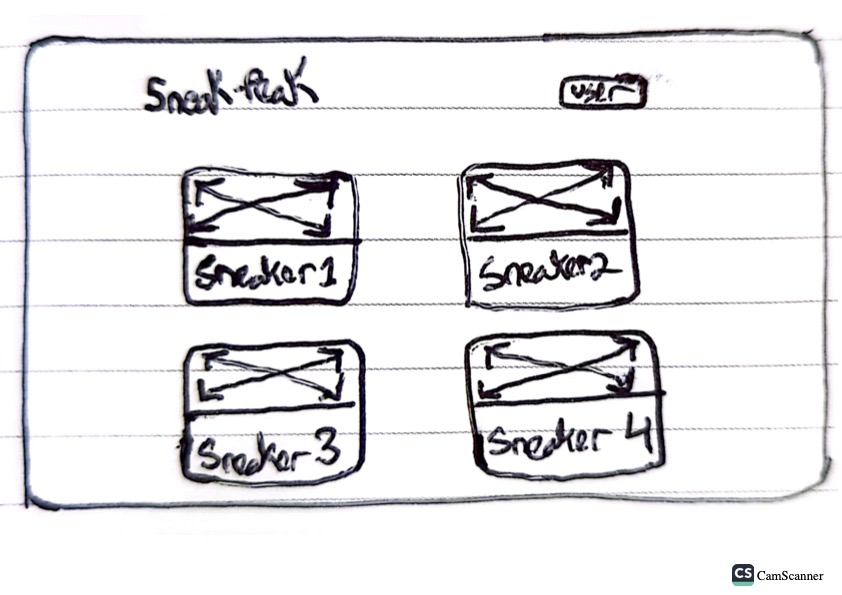
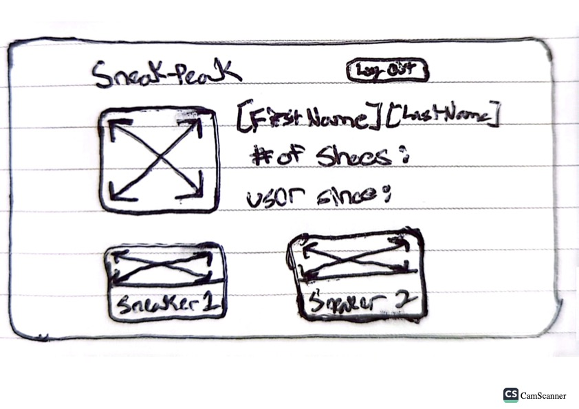
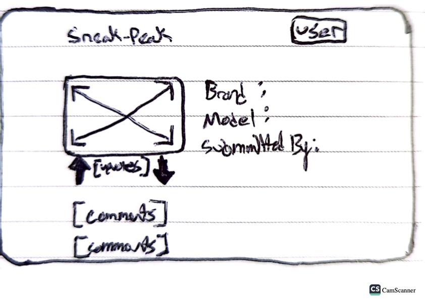
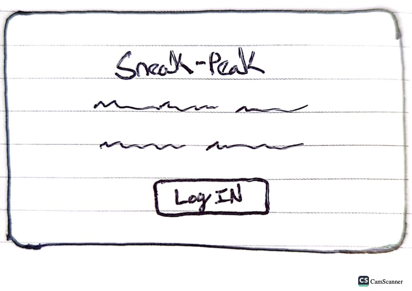
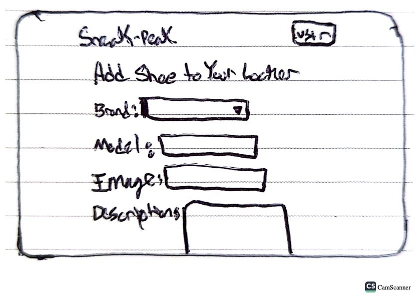
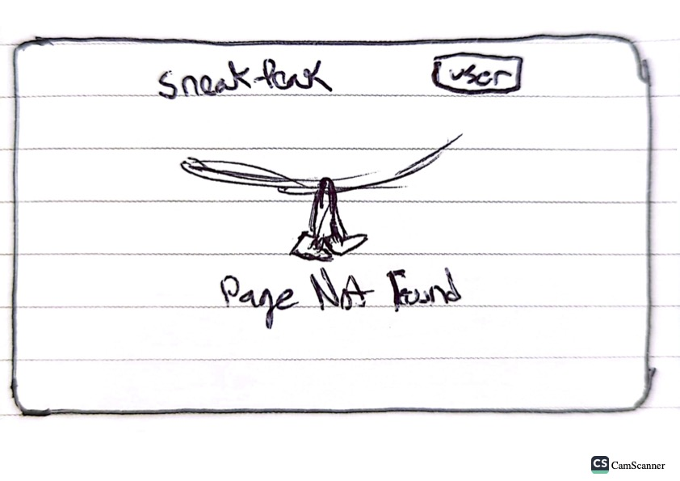

# Wireframes

Reference the Wireframing final project guide in the course portal for more information about how to complete this deliverable.

## List of Pages

[👉🏾👉🏾👉🏾 List the pages you expect to have in your app, with a ⭐ next to pages you have wireframed]

- Landing Page ⭐
- Main Dashboard ⭐
- Individual Shoe ⭐
- Create a Shoe ⭐
- Profile Page ⭐
- Page Not Found ⭐

## Wireframe 1: Landing Page

## Wireframe 2: Main Dashboard

## Wireframe 3: Individual Shoe

## Wireframe 4: Creating a Shoe

## Wireframe 5: Profile Page

## Wireframe 6: Page Not Found

